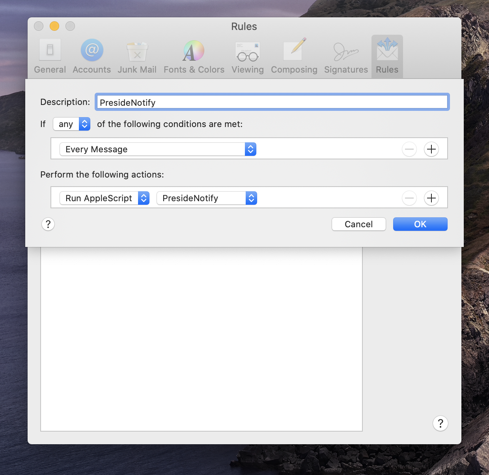

# PresideNotify
PresideNotify is of tools for monitoring email Inboxes and/or folders and sending notifications to the Preside iPhone app when new emails arrive.  

 
      
## Prerequisites
Before using these monitoring tools, you should go to the More > Syncing screen in Preside and set the 'Background Sync' type to "Remote (private computer)". That should lead you through a process whereby you register for a Preside.io account if you don't already have one. You should also enable the 'New email notification' option on that same 'Syncing & Notifications' screen. That should obtain permission from iOS to issue notifications. 

To check to make sure you have everything setup properly, open the terminal app or other shell and issue a 'curl' command like:

curl --user https://users.preside.io/preside/GHSendPushMsg?alertMsg=Test. 

That should cause a notification to appear on your device.             

 

## Applescript monitoring
The Applescript option uses the Mac Mail app to monitor for new emails. You'll need to leave that app always running for the notifications to be delivered. The way this works is that a 'rule' is setup in Mac Mail app that runs the applescript whenever a new mail is received. 

To make use of this tool, start by downloading the PresideNotify.applescript file. Then double click on the file to open it in the Applescript Editor. Next, edit the 'set ghUser to ""' line and insert your own Preside.io user name between the "".  Then, edit the 'set ghPassword to ""' line and insert your Preside.io password in between the "". Exit the Applescript Editor and move the script into the ~/Library/Application\ Scripts/com.apple.mail folder.

At this point the applescript is configured and is ready to be setup as a rule inside the Mac Mail app. To do that, open the Mail app and click 'Mail' then 'Preferences'. Then click on 'Rules' towards the top right. Next, click 'Add rule' to create the new rule. Enter 'PresideNotify' for the 'Description'. Then, change the criteria to 'If *any* conditions are met' and '*Every message'. Next, change the actions to '*Run applescript*' and select the PresideNotify applescript.

